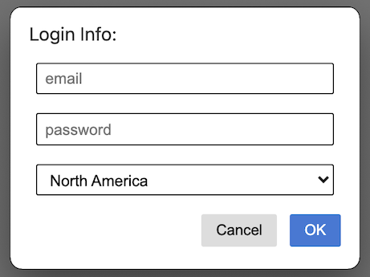

# Custom Electron Prompt

[](https://www.npmjs.com/package/custom-electron-prompt)
[](https://github.com/Araxeus/custom-electron-prompt/blob/main/LICENSE)
[](https://github.com/Araxeus/custom-electron-prompt)
[](https://araxeus.github.io/custom-electron-prompt)

Custom prompt for Electron made easy with various templates

There are currently 5 types available: Input / Keybind / Counter / Select / MultiInput

There is also an option for a button with user-defined `onclick` function.


## Example of a Simple Prompt from Input Type


## Usage

* 1: Install the npm package to your project directory with
  ```bash
  npm install custom-electron-prompt
  ```
  or
  ```bash
   yarn add custom-electron-prompt
   ```

* 2: Import prompt

  ```javascript
  const prompt = require('custom-electron-prompt')
  ```

* 3: Create a prompt

  ```javascript
  prompt([options, parentBrowserWindow])
  ```

   calling the prompt function returns a Promise

   Promise resolve returns the input or returns null if prompt was canceled

       On error, Prompise reject returns custom error message

### Simple Input Example

```javascript
const prompt = require('./prompt');

prompt({
    title: 'Prompt example',
    label: 'URL:',
    value: 'http://example.org',
    inputAttrs: {
        type: 'url'
    },
    type: 'input'
})
.then((r) => {
    if(r === null) {
        console.log('user cancelled');
    } else {
        console.log('result', r);
    }
})
.catch(console.error);
```

## Special Prompt Types

----

### keybind

Create a prompt with possibly multiple keybind selects

Must specify `keybindOptions` with valid entries in format:

```javascript
keybindOptions: [
    { value: "copyAccelerator", label: "Copy", default: "Ctrl+C" }
    { value: "pasteAccelerator", label: "Paste", default: "Ctrl+V" }
]
```

Return an array made of objects in format

`{value: "copyAccelerator", accelerator: "Ctrl+Shift+Insert"}`

where `accelerator` is the input for the `value` you registered

 <details>
  <summary> Code Example </summary>

 ```javascript
const kb = ($value, $label, $default) => { return { value: $value, label: $label, default: $default } };
prompt({
	title: "Keybinds",
	label: "Select keybind for each method",
	type: "keybind",
	value: "2", // Doesn't do anything here
	keybindOptions: [
		{ value: "volumeUp", label: "Increase Volume", default: "Shift+PageUp" },
		kb("volumeDown", "Decrease Volume", "Shift+PageDown"),
		kb("playPause", "Play / Pause") // (null || empty string || undefined) == no default
	],
	resizable: true,
	customStylesheet: "dark",
}, win).then(input => {
	if (input)
		input.forEach(obj => console.log(obj))
	else
		console.log("Pressed Cancel");
})
	.catch(console.error)
 ```
 </details>

 <details>
  <summary> Screenshots </summary>


</details>

----

### counter

Create a prompt for selecting numeric values, with integrated `+` and `-` buttons

You **can** specify `counterOptions` with valid entries in format:

```javascript
counterOptions: {
    minimum: 0, //defaults to null
    maximum: 250, //defaults to null
    multiFire: true //default to false
}
```

 minimum and maximum of numeric counter, and multifire indicate if continuous input is enabled.

 <details>
  <summary> Code Example </summary>

 ```javascript
prompt({
	title: "Counter",
	label: "Choose a number:",
	value: "59",
	type: "counter",
	counterOptions: { minimum: -69, maximum: null, multiFire: true },
	resizable: true,
	height: 150,
	width: 300,
	customStylesheet: "dark",
}, win).then(input => console.log(`input == ${input}`)).catch(console.error)
 ```
 </details>

 <details>
  <summary> Screenshots </summary>


</details>

----

### select

Create a prompt with a dropdown select menu.

Must specify selectOptions with valid entries in **one** of the following format:

```javascript
 selectOptions: ["thisReturn0", "thisReturn1", "thisReturn2"]
 selectOptions: {
    0: "thisReturn0",
    1: "thisReturn1",
    2: "imSelected",
    potato: "thisReturnPotato"
 }
```

<details>
  <summary> Code Example </summary>

 ```javascript
prompt({
	title: "Select",
	label: "Choose an option:",
	type: "select",
	value: "2",
	selectOptions: ["thisReturn0", "thisReturn1", "imSelected", "thisReturn3"],
	// 	selectOptions: {0: "thisReturn0", 1: "thisReturn1", 2: "imSelected" , potato: "thisReturnPotato"},
	resizable: true,
	height: 150,
	width: 300,
	customStylesheet: "dark",
}, win).then(input => console.log(`input == ${input}`)).catch(console.error)
 ```
 </details>

 <details>
  <summary> Screenshots </summary>


</details>

----

### multiInput

Create a prompt with multiple inputs. Select inputs can also be used.

Returns an array with with input in same order that was given to the options, for example:
multiInputOptions: [{usernameOptions}, {passwordOptions}] could return ["Jack", "61523"]

Must specify multiInputOptions with valid entries in the following format:

```javascript
 multiInputOptions: [{myinputoptions1}, {myinputoptions2}]
```

<details>
  <summary> Code Example </summary>

 ```javascript
prompt({
    title: "credentials",
    label: "Login Info:",
    type: "multiInput",
    multiInputOptions:
        [
            {
                inputAttrs:
                {
                    type: "email",
                    required: true,
                    placeholder: "email"
                }
            },
            {
                inputAttrs:
                {
                    type: "password",
                    placeholder: "password"
                }
            },
            {
                selectOptions: { na: "North America", eu: "Europe", other: "Other" },
                value: "2"
            }
        ],
    resizable: true,
    width: 300,
    height: 225,
}, win).then(input => console.log(`input == ${input}`)).catch(console.error)
 ```
 </details>

 <details>
  <summary> Screenshots </summary>


This screenshot also contains a custom button.



</details>

----

## Options object (optional)

### ⚠️ New options :

| Key                | Explanation                                                                                                                                                                                                                                                    |
| ------------------ | -------------------------------------------------------------------------------------------------------------------------------------------------------------------------------------------------------------------------------------------------------------- |
| frame              | (optional, boolean) Wether to create prompt with frame. Defaults to true.                                                                                                                                                                                      |
| customScript       | (optional, string) The local path of a JS file to run on preload. Defaults to null.                                                                                                                                                                            |
| enableRemoteModule | (optional, boolean) Wether the prompt window have remote modules activated, Defaults to false.                                                                                                                                                                 |
| customStylesheet   | (optional, string) The local path of a CSS file to customize the style of the prompt window, **you can use just "dark" to use the premade dark skin**. Defaults to null.                                                                                       |
| type               | (optional, string) The type of input field, either 'input' for a standard text input field or 'select' for a dropdown type input or `counter` for a number counter with buttons. or `keybind` for an electron accelerator grabber. or **`multiInput` to use more than 1 input in a prompt** Defaults to 'input'.  |
| counterOptions     | (optional, object) minimum and maximum of counter, and if continuous input is enabled. format: `{minimum: %int%, maximum: %int%, multiFire: %boolean%`. min+max values defaults to null and multiFire defaults to false.                                       |
| keybindOptions     | (optional, object)  Required if type=keybind. represent an array of objects in format: `{type: %string%, value: %string%, default: %string%}`. `default` has to be a valid accelerator to work                                                                 |
| multiInputOptions     | (optional, object) an Array of objects having options for every input, format: `[{inputAttrs:{type:'email'}},{inputAttrs:{type:'password'}}]`, `[object, object]` to use it without passing any options simply `[{},{},{}]`, just create x amount of empty objects to add x inputs.                                       |
| button       | (optional, object) adds a button after the success(OK) with a custom label, onClick and attributes. Object format: `{label: 'myLabel', click: () => alert("click"), attrs: {style: 'background: black'}}`, `{label: %string%, click: %function%, attrs: %object%}`|

### Original options:

| Key            | Explanation                                                                                                                                                                                                                    |
| -------------- | ------------------------------------------------------------------------------------------------------------------------------------------------------------------------------------------------------------------------------ |
| title          | (optional, string) The title of the prompt window. Defaults to 'Prompt'.                                                                                                                                                       |
| label          | (optional, string) The label which appears on the prompt for the input field. Defaults to 'Please input a value:'.                                                                                                             |
| buttonLabels   | (optional, object) The text for the OK/cancel buttons. Properties are 'ok' and 'cancel'. Defaults to null.                                                                                                                     |
| value          | (optional, string) The default value for the input field. Defaults to null.                                                                                                                                                    |
| type           | (optional, string) The type of input field, either 'input' for a standard text input field or 'select' for a dropdown type input or 'counter' for a number counter with buttons. Defaults to 'input'.                          |
| inputAttrs     | (optional, object) The attributes of the input field, analagous to the HTML attributes: `{type: 'text', required: true}` -> `<input type="text" required>`. Used if the type is 'input'.                                       |
| selectOptions  | (optional, object) The items for the select dropdown if using the 'select' type in the format 'value': 'display text', where the value is what will be given to the then block and the display text is what the user will see. |
| useHtmlLabel   | (optional, boolean) Whether the label should be interpreted as HTML or not. Defaults to false.                                                                                                                                 |
| width          | (optional, integer) The width of the prompt window. Defaults to 370.                                                                                                                                                           |
| minWidth       | (optional, integer) The minimum allowed width for the prompt window. Default to width if specified or default_width(370).                                                                                                      |
| height         | (optional, integer) The height of the prompt window. Defaults to 130.                                                                                                                                                          |
| minHeight      | (optional, integer) The minimum allowed height for the prompt window. Default to height if specified or default_height(160).                                                                                                   |
| resizable      | (optional, boolean) Whether the prompt window can be resized or not (also sets useContentSize). Defaults to false.                                                                                                             |
| alwaysOnTop    | (optional, boolean) Whether the window should always stay on top of other windows. Defaults to false                                                                                                                           |
| icon           | (optional, string) The path to an icon image to use in the title bar. Defaults to null and uses electron's icon.                                                                                                               |
| menuBarVisible | (optional, boolean) Whether to show the menubar or not. Defaults to false.                                                                                                                                                     |
| skipTaskbar    | (optional, boolean) Whether to show the prompt window icon in taskbar. Defaults to true.                                                                                                                                       |

If not supplied, it uses the defaults listed in the table above.

### parentBrowserWindow (optional)

The window in which to display the prompt on. If not supplied, the parent window of the prompt will be null.

### customScript (optional)

Create the script with the following template:

```javascript
module.exports = () => {
    // This function will be called as a preload script
    // So you can use front features like `document.querySelector`
};
```
----

### Custom/Extra Button (optional)

Adds an extra/custom button with special functionalities other than success or error. Passing a `label` will update the button's innerHTML, `click` should be a funtion which will execute **onclick**, lastly `attrs` should contain all the attributes that should be added to the button such as custom styles.

 <details>
  <summary> Code Example </summary>


```javascript
await prompt({
            title: 'Login credentials',
            label: 'Credentials',
            value: 'http://example.org',
            inputAttrs: {
                type: 'url'
            },
            type: 'multiInput',
            multiInputOptions:
                [{
                    label: "username",
                    inputAttrs:
                    {
                        type: "email",
                        required: true,
                        placeholder: "email"
                    }
                },
                {
                    label: "password",
                    inputAttrs:
                    {
                        type: "password",
                        placeholder: "password"
                    }
                }],
            // customStylesheet: "dark",
            button:
            {
                label: "Autofill",
                click: () =>
                {
                    document.querySelectorAll("#data")[0].value = "mama@young.com";
                    document.querySelectorAll("#data")[1].value = "mysecretrecipe";
                },
                attrs:
                {
                    abc: 'xyz'
                }
            }
        }));
```

</details>

 <details>
  <summary> Screenshots </summary>


</details>

----

> Disclaimer: this package is a highly modified version of  [electron-prompt](https://github.com/p-sam/electron-prompt)
>
> The author of that package didn't want much contributions or changes, but you are more than welcome to contribute and create new stable prompt features over here :)
